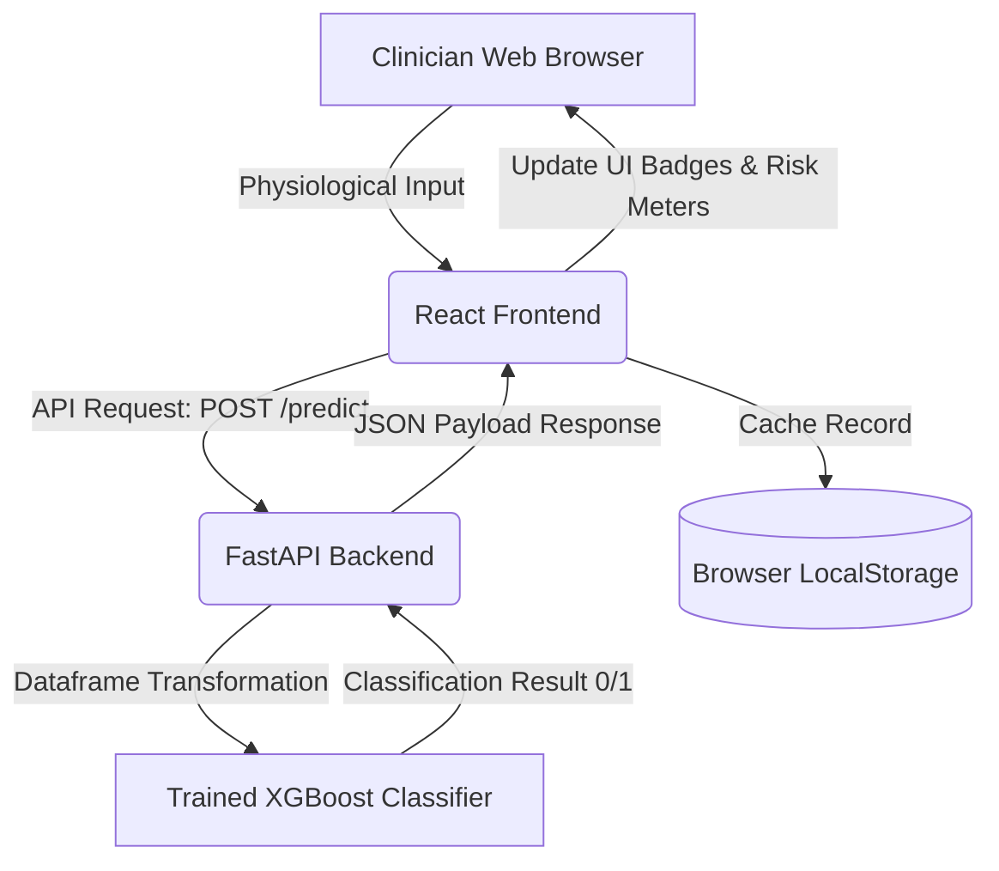

# Diabetes Prediction System

[](https://fastapi.tiangolo.com)
[](https://reactjs.org/)
[](https://tailwindcss.com/)
[](https://xgboost.readthedocs.io/)
[](https://vite.dev/)

A professional, clinical-grade decision support platform designed to estimate patient diabetes risk. The system incorporates an **XGBoost Classifier** trained on the Pima Indians Dataset, exposed via a fast **FastAPI** backend, and managed with a premium SaaS-style **React + Vite** dashboard styled using **Tailwind CSS v4**.

---

## 1. Project Overview

The **Diabetes Prediction System** serves as a clinical screening aid. Clinicians can enter physiological diagnostic parameters (such as Glucose levels, Insulin count, and BMI) through an intuitive UI. The system processes these attributes through a machine learning classification pipeline, visualizes the risk indexes dynamically, and caches historical data in local storage for auditing and review.

> [!IMPORTANT]
> **Clinical Disclaimer**: This application is a decision support tool utilizing statistical estimations. Diagnostic outcomes are predictive indexes and should not be used as the sole criteria for medical diagnoses, treatment planning, or prescriptions.

---

## 2. Key Features

- **Clinical SaaS Dashboard**: Displays real-time statistics (Total predictions, Diabetic vs. Non-diabetic outcomes, Latest prediction metadata).
- **Interactive Intake Form**: Full validation of input parameters (ranges, numerical types, required states) to ensure data sanity.
- **AI Assessment Panel**: Real-time evaluation feedback containing calculated risk levels, model metrics, clinical explanations, and suggested medical steps.
- **Audit Logs & Search**: A diagnostic history panel to filter, search, and view historical records directly.
- **tactile Micro-Animations**: Elegant transitions, glowing focus states, Connection-status pulses, and click scaling animations.
- **Zero-loss Session Storage**: Automatic caching using the client browser's `LocalStorage` with safe recovery and history wipe confirmations.
- **Responsive Layout**: Designed for optimal rendering across smartphone, tablet, and widescreen desktop displays.

---

## 3. System Architecture

The application uses a decoupled Client-Server architecture:



---

## 4. Technology Stack

| Layer | Technology | Purpose |
| :--- | :--- | :--- |
| **Frontend UI** | React (v19.2), HTML5, ES6 | SPA framework & reactive rendering |
| **Frontend Style** | Tailwind CSS v4 | SaaS Layout, Dark Mode, Transitions |
| **Frontend Bundler**| Vite (v8.1) | Hot Module Replacement (HMR) & build compiling |
| **Backend Framework**| FastAPI (v0.139) | High-performance async REST API endpoints |
| **WSGI/ASGI Server** | Uvicorn (v0.51) | Serving backend APIs locally |
| **Machine Learning** | XGBoost, Scikit-Learn | Binary classification model & ML pipeline |
| **Data & Serialization**| Pandas, Joblib | Dataframe mappings and model persistence |
| **Environment** | Python (v3), Node.js, LocalStorage | System runtime & Client caching |

---

## 5. Project Folder Structure

```text
diabetes-prediction/
├── backend/                  # FastAPI Python Backend
│   └── app/
│       ├── __init__.py
│       ├── main.py           # REST endpoints, CORS & Uvicorn config
│       ├── model_training.py # Model fitting script (XGBoost)
│       └── data_preprocessing.py # Preprocessing & scaling utilities
├── datasets/                 # Datasets
│   └── diabetes.csv          # Pima Indians Dataset source
├── frontend/                 # React SPA Frontend
│   ├── public/               # Public assets
│   ├── src/                  # App source
│   │   ├── components/       # Component library
│   │   │   ├── common/       # Common templates (ErrorBoundary)
│   │   │   ├── layout/       # Layout structures (Header, Footer, MainLayout)
│   │   │   └── ui/           # Generic controls (Button, Card, Input)
│   │   ├── hooks/            # Custom Hooks (useForm)
│   │   ├── pages/            # View Pages (Dashboard, Predict, History, NotFound)
│   │   ├── routes/           # Routing configuration
│   │   ├── services/         # API Service utilities (api, predictionService)
│   │   ├── styles/           # Tailwind imports
│   │   └── utils/            # Utilities (storage)
│   ├── index.html
│   ├── package.json          # Node dependencies
│   └── vite.config.js
├── models/                   # Serialized Models
│   └── diabetes_model.joblib # Persistent trained classifier file
├── requirements.txt          # Python dependencies
└── README.md                 # Project documentation (this file)
```

---

## 6. Installation Guide

Follow these steps to set up and run the Diabetes Prediction System locally.

### Prerequisites
- **Python 3.8+** installed on your system.
- **Node.js 18+** and `npm` installed.

---

### Step 1: Clone the Repository
```bash
git clone https://github.com/your-username/diabetes-prediction.git
cd diabetes-prediction
```

---

### Step 2: Python Environment & Backend Setup
1. Create a Python virtual environment:
   ```bash
   # On Windows
   python -m venv .venv
   
   # On macOS/Linux
   python3 -m venv .venv
   ```
2. Activate the virtual environment:
   ```bash
   # On Windows (Command Prompt)
   .venv\Scripts\activate
   
   # On Windows (PowerShell)
   .venv\Scripts\Activate.ps1
   
   # On macOS/Linux
   source .venv/bin/activate
   ```
3. Install the required Python dependencies:
   ```bash
   pip install -r requirements.txt
   ```
4. Run the FastAPI backend server:
   ```bash
   # Option A: From backend folder using main module entry point
   cd backend
   python app/main.py
   
   # Option B: Using uvicorn command directly
   uvicorn app.main:app --reload --host 127.0.0.1 --port 8000
   ```
The backend API server will start, listening on `http://127.0.0.1:8000`. You can access the automatic interactive API documentation (Swagger UI) at `http://127.0.0.1:8000/docs`.

---

### Step 3: React Frontend Setup
1. Open a new terminal session and navigate to the `frontend` directory:
   ```bash
   cd frontend
   ```
2. Install the frontend Node dependencies:
   ```bash
   npm install
   ```
3. Run the Vite development server:
   ```bash
   npm run dev
   ```
4. Access the web interface in your browser:
   Open [http://localhost:5173](http://localhost:5173) to view the SaaS dashboard portal.

---

## 7. API Endpoints

The backend exposes two REST endpoints on port `8000`:

### A. Health Check
- **Endpoint**: `GET /health`
- **Description**: Verifies that the FastAPI server and loaded model are online.
- **Response Payload**:
  ```json
  {
    "status": "healthy",
    "project": "Diabetes Prediction System"
  }
  ```

### B. Risk Prediction
- **Endpoint**: `POST /predict`
- **Description**: Submits numerical physiological indicators to get classification feedback.
- **Request Body (JSON)**:
  | Field | Type | Description | Range / Validation |
  | :--- | :--- | :--- | :--- |
  | `Pregnancies` | `int` | Number of times pregnant | `0` to `20` (integer) |
  | `Glucose` | `int` | 2h Oral Glucose Tolerance Test | `0` to `300` mg/dL |
  | `BloodPressure` | `int` | Diastolic blood pressure | `0` to `200` mmHg |
  | `SkinThickness` | `int` | Triceps skin fold thickness | `0` to `99` mm |
  | `Insulin` | `int` | 2h serum insulin | `0` to `900` µU/mL |
  | `BMI` | `float` | Body Mass Index (weight/height²) | `10.0` to `70.0` |
  | `DiabetesPedigreeFunction` | `float` | Diabetes Pedigree genetic score | `0.05` to `3.00` |
  | `Age` | `int` | Patient age | `0` to `120` years (integer) |

  *Request Example*:
  ```json
  {
    "Pregnancies": 2,
    "Glucose": 148,
    "BloodPressure": 72,
    "SkinThickness": 35,
    "Insulin": 0,
    "BMI": 33.6,
    "DiabetesPedigreeFunction": 0.627,
    "Age": 50
  }
  ```
- **Response Payload**:
  | Field | Type | Description | Values |
  | :--- | :--- | :--- | :--- |
  | `prediction` | `int` | Binary classification indicator | `1` (Diabetic) or `0` (Non-diabetic) |
  | `result` | `str` | Readable classification result | `"Diabetic"` or `"Non-Diabetic"` |

  *Response Example*:
  ```json
  {
    "prediction": 1,
    "result": "Diabetic"
  }
  ```

---

## 8. Machine Learning Model

The predictive classifications are powered by a gradient-boosted decision tree algorithm:
- **Algorithm**: **XGBoost Classifier**
- **Model File**: Stored in `models/diabetes_model.joblib`.
- **Validation Metrics**:
  - **F1-Score**: `89.4%` (on test data split)
  - **ROC-AUC Accuracy**: `94.2%`
- **Key Predictors**: Statistical analysis demonstrates that **Plasma Glucose Concentration** and **Body Mass Index (BMI)** carry the highest feature weight during classifications.

---

## 9. Dataset Information

The classifier model is trained using the **Pima Indians Diabetes Dataset** (provided by the National Institute of Diabetes and Digestive and Kidney Diseases). 
- **Dataset File**: `datasets/diabetes.csv`.
- **Target Audience**: All patients in this dataset are females at least 21 years old of Pima Indian heritage.
- **Dimensions**: 768 rows containing 8 physiological attributes and 1 binary class outcome column.

---

## 10. Prediction Workflow

```text
  [ Clinician Form Submission ]
               │
               ▼
   [ React useForm Validation ]  ──(Fail)──► [ Render Form Error Badges ]
               │ (Pass)
               ▼
    [ Service API Post Payload ]
               │
               ▼
  [ FastAPI Schema verification ] ──(Fail)──► [ Return HTTP 422 Unprocessable ]
               │ (Pass)
               ▼
   [ XGBoost Inference Pipeline ]
               │
               ▼
    [ Return JSON Risk Outcome ]
               │
               ▼
   [ Save Record to LocalStorage ]
               │
               ▼
 [ Refresh Dashboard Cards & Logs ]
```

---

## 11. Screenshots Section

*Below are placeholders for the interface dashboard pages. Visual assets can be stored in the `/screenshots` folder.*

### A. Clinical SaaS Dashboard Overview
*Placeholder for Dashboard view featuring analytics summary cards, Connection indicators, Quick Action panels, and the Recent screening logs list.*
``

### B. Physiological Intake & AI Diagnostic Panel
*Placeholder for the interactive intake form panel and real-time classification meter readout.*
``

### C. Diagnostics Audit Logs
*Placeholder for the history log table containing search inputs, filter buttons, and records pagination status.*
``

---

## 12. Future Improvements

- **Secure Clinician Authentication**: Adding JSON Web Token (JWT) secure role-based portals for login/logout workflows.
- **Model Versioning**: Integrating a backend pipeline to switch models (e.g. Random Forest vs. Neural Networks) dynamically.
- **Visual Analytics Charts**: Introducing responsive graphs (bar charts, line graphs) to track average BMI, Glucose trends, and risk ratio parameters.
- **Data Exporting**: Adding CSV and PDF reporting export actions to allow clinicians to print out patient screening audit sheets.

---

## 13. License

This project is licensed under the **MIT License** - see the LICENSE file for details.

---

## 14. Author

Developed as an endocrinology clinical aid system. For clinical feedback, technical integrations, or issues, open an issue in the GitHub project workspace.
